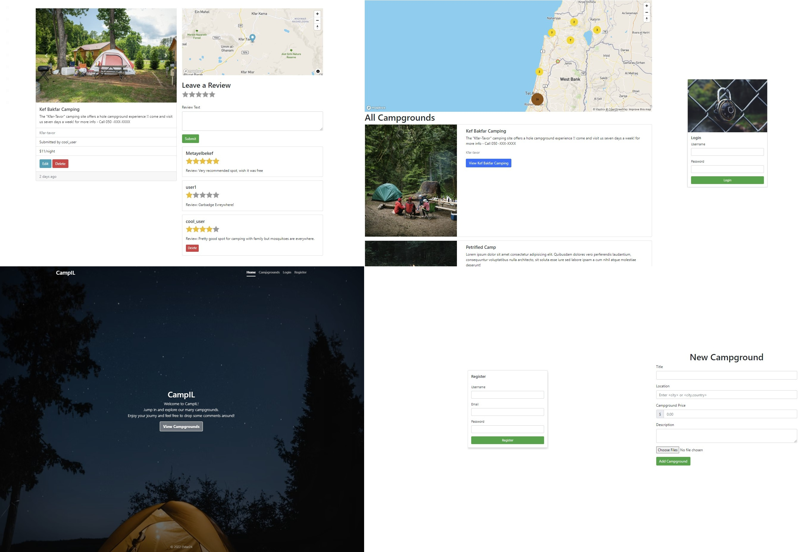

<div align="center">
<h1 align="center">CampIL</h1>
  
<<<<<<< HEAD
</div>
=======
</p>
>>>>>>> afcd848b4596a715bc4da8f8d489a5b1de9d9cc1


A Node.js web application project. It is a web application designed to add, rate and review different campgrounds, different users(read campers) can put in their comments and concerns, so that it is a well informed and well prepared camping trip for other users. 
This project bassed on a Udemy course WDB - by Colt Steele. 

### Features: 
I wrote the main features if you are just curious about what isniside.

#### Security: 
Mongo Injection | XSS | Escaping Injection | Cookie & Session handler
#### User: 
Authentication | Autorization | Session & Cookie control | Some xss 
#### Campground: 
Create/Update/Edit/Delete camp | Pictures handle | Cluser Map | Individual Map
#### Review : 
Add & Edit user review.


## Setup
If you would like to make a separate location except for Israel - delete this line or change the initials
```
*Go to* - CampIL/controllers/campgrounds.js 
countries: ["il"], //["<Enter ur specific country - example: il - stands for Israel >"]
```
1. Create a Cloudinary account, MongoDB database and Mapbox account.
2. Add details of these accounts to an .env file as provided in: [Settings](#Settings)
3. (Optionally) Seed the database

```
"node seeds/index.js"
```
4. Run the Application 
```
"npm start"
```

## Settings

This is the list of environment variables that can be added to a .env file to make the application fully functional.

- CLOUDINARY_CLOUD_NAME # Name of your Cloudinary cloud.
- CLOUDINARY_KEY # API key of your Cloudinary cloud.
- CLOUDINARY_SECRET # Secret of your Cloudinary cloud.
- MAPBOX_TOKEN # Access token to Mapbox tools.
- DB_URL # Link to your MongoDB database if you want run over your account.
- SECRET # Secret for the Mongo Store and session configuration.
- PORT # Port to start the application on.


## RestAPI 
#### Campgrounds

| Method  | Endpoint          | Description                 |
|---------|-------------------|-----------------------------|
| GET     | /                 | List of campgrounds                   |
| GET     | /new   			  | render form for new campground         |
| GET     | /:id   		      | Get specific campground and his reviews   |
| POST    | /:id	  		  | Create a new Campground             | 
| PUT  	  | /:id   			  | Update specific campground     |
| DELETE  | /:id   			  | Delete a specific campground|
| GET     | /:id/edit 	      | Get an edit form for specific campground| 

#### Users

| Method  | Endpoint          | Description                 |
|---------|-------------------|-----------------------------|
| GET     | /register         | Get register form           |
| POST    | /register   	  | Register user               |
| GET     | /login   	      | Get login form              |
| POST    | /login        	  | Login                 |
| GET     | /logout			  | Logout

#### Reviews

| Method  | Endpoint          | Description                 |
|---------|-------------------|-----------------------------|
| POST     | /                | Try post new review         |
| DELETE   | /:id  			  | Try delete specific reviww by id|


## Project Structure

```
cloudinary
     ├── ...                # Cloudinary configuration
 controllers
     ├── ...                # Control all route actions
 models
     ├── ...                # Database models
 public
     ├── ...                # Served css and js files
 routes
     ├── ...                # Map all routes
 seeds
     ├── ...                # Initial db seed
 utils
     ├── ...                # Error handling
 views
     ├── campgrounds\
             ├── ...        # Campground markups
     ├── layouts\
             ├── ...        # Boilerplate markup
     ├── partials\
             ├── ...        # Partial markups
     ├── users\
             ├── ...        # User markups
     ...                    # Additional markups
 .env                       # Hold environment variables
 app.js                     # Overall setup
 middleware.js              # All middleware
 schemas.js                 # Joi schemas
 
 ```
